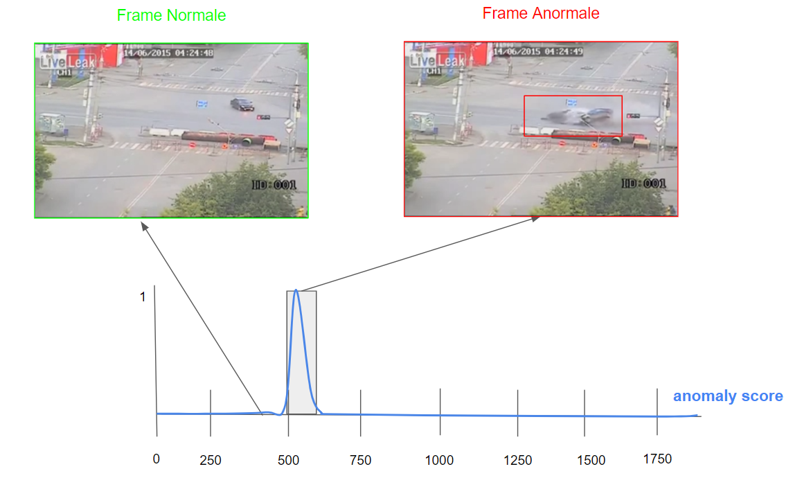
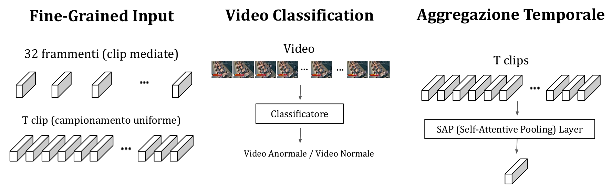
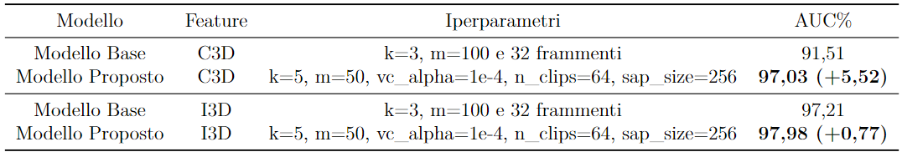
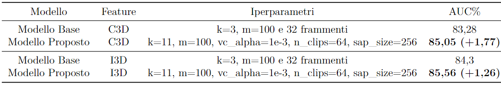
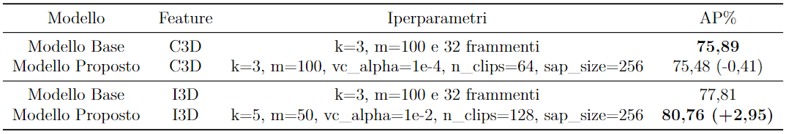
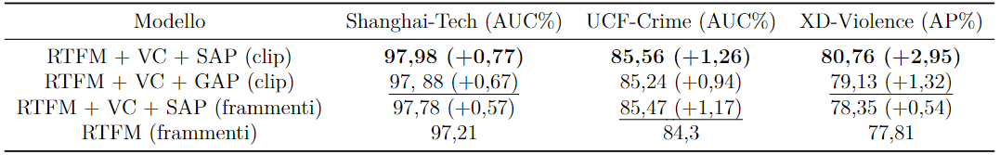
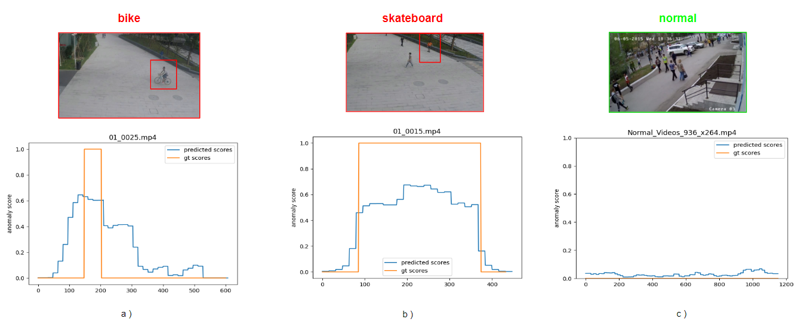
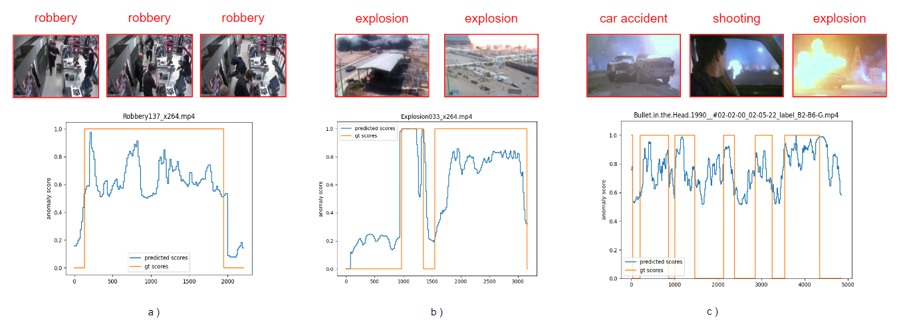

# Weakly Supervised Video Anomaly Detection using Deep Learning
Questo repository presenta un lavoro di tesi incentrato sul rilevamento delle anomalie nei video con approccio debolmente supervisionato.
L'obiettivo della tesi è stato quello di effettuare un attenta analisi dello stato dell'arte,
per poi proporre e sviluppare una soluzione innovativa, valutando il metodo proposto sui principali dataset di benchmark.


# Definizione Problema

<center>
    
</center>

Il task di video anomaly detection può
essere definito come un problema di regressione, dove a ogni frame di un video viene
assegnato uno score di anomalia: uno score alto indica un'anomalia, mentre uno score basso
la normalità. Nell'approccio weakly supervised la posizione temporale delle anomalie all'interno del video non è conosciuta.


# Metodo Proposto

<center>
    
</center>

Il metodo proposto si basa sul modello [RTFM](https://arxiv.org/pdf/2101.10030.pdf) al quale sono state apportate delle modifiche al fine di definire una nuova soluzione.

La prima modifica apportata al modello è quella di mantenere le singole clip di un video anzichè suddividere i video in 32 frammenti di dimensioni uguali.
Questo permette di riconoscere dettagli più fini, individuare anomalie più brevi e prevenire che le clip anomale
siano sopraffatte da quelle normali nello stesso frammento.
Per far ciò, durante la fase di addestramento è stato effettuato un campionamento uniforme per ottenere un numero
fisso di clip per ogni video.

Un'ulteriore modifica consiste nell'introdurre un task ausiliare di video classification (VC),
al fine di aiutare il più complesso task di rilevamento di anomalie. Infine viene introdotto un layer SAP(Self Attentive Pooling) per aggregare l'informazione temporale considerando l'importanza delle singole clip.


# Confronto con il Modello Base

|              Shanghai-Tech              |
| :-------------------------------------: |
|  |

|                UCF-Crime                |
| :-------------------------------------: |
|  |

|               XD-Violence               |
| :-------------------------------------: |
|  |


# Analisi Modifiche Effettuate
Inoltre si è dimostrata l'efficacia delle modifiche apportate al modello su I3D, in particolare
riguardo l'utilizzo di clip e del layer SAP. L'introduzione di SAP mostra un vantaggio rispetto al più semplice layer GAP(Global Average Pooling). Inoltre, il modello proposto mostra miglioramenti considerando le clip rispetto ai frammenti.

<center>
    
</center>

# Esempi di Predizione
Anomalie abbastanza brevi con sfondi meno complessi esempi a) e b) inoltre viene mostrato un esempio normale c).
<center>
    
</center>

Casi più complessi con anomalie più lunghe a) o riconoscere più
di un anomalia all'interno dello stesso video b). Infine viene riportato un esempio c) nel quale vengono identificate molteplici anomalie
di diverso tipo all'interno dello stesso video.
<center>
    
</center>


# Esecuzione

Questo repository non include le feature già estratte. Per generarle si può utilizzare il seguente repository [MagazzuGaetano/Feature-Extraction-for-Video-Anomaly-Detection](https://github.com/MagazzuGaetano/Feature-Extraction-for-Video-Anomaly-Detection).

Per eseguire il codice di addestramento:
```bash
python -m visdom.server
python main.py --dataset shanghai --feat-extractor i3d
```

Per eseguire il codice di test:
```bash
python -m visdom.server
python test.py --dataset shanghai --feat-extractor i3d
```

Per elencare tutti i parametri disponibili usare il comando:
```bash
python main.py --help
```

# Citazioni

Il modello proposto è codice utilizzato sono basati sul seguente lavoro [RTFM](https://github.com/tianyu0207/RTFM):
- RTFM: Tian, Yu, et al. ["Weakly-supervised video anomaly detection with robust temporal feature magnitude learning."](https://arxiv.org/pdf/2101.10030.pdf) Proceedings of the IEEE/CVF international conference on computer vision. 2021.
